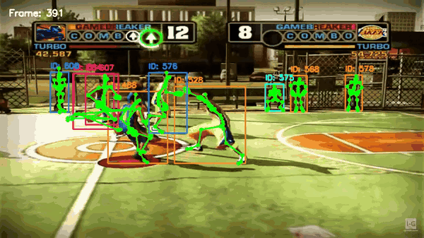

# skeleton-maker

Draw 3D body-pose skeletons on **any** video.

Point it at a clip; it tracks the people, asks NVIDIA's [3D Body Pose NIM](https://build.nvidia.com/nvidia/body-pose)
for a 77-joint 3D skeleton per person per frame, and writes a video with the
skeletons drawn on top.

```bash
skeleton-maker all myclip.mp4
```



*A few seconds of a 20-second run. YOLO tracks the players, the NIM returns a
77-joint skeleton for each one, and the overlay draws them — boxes and ids per
tracked body in colour, 2D keypoints in green. Poses came back for 599 of the 600
frames.*

## What it actually does

The NIM is a pose model, not a detector. It estimates a pose **once per supplied
box**, so it needs someone to say where the people are and to keep a stable id on
each one. This tool supplies that with [Ultralytics YOLO](https://docs.ultralytics.com) +
ByteTrack, then calls the hosted NIM over gRPC and renders the result.

```text
your video ──▶ conform (ffmpeg) ──▶ detect + track (YOLO/ByteTrack)
                                          │
                                          ▼
                              tracked boxes, one per person per frame
                                          │
                                          ▼
                    NVIDIA 3D Body Pose NIM  (grpc.nvcf.nvidia.com:443)
                                          │
                                          ▼
              77 2D + 3D joints, confidences, quaternions, root pose
                                          │
                                          ▼
                            overlay video + pose.json
```

## Requirements

- Python 3.10–3.12
- `ffmpeg` and `ffprobe` on `PATH`
- An NVIDIA API key — get one at
  <https://build.nvidia.com/nvidia/body-pose> ("Get API Key"). The hosted
  endpoint is free to try and needs **no** local GPU.
- Optional: `yt-dlp` for `skeleton-maker download`

The NIM client is gRPC, so it runs on macOS, Windows and Linux, including arm64.
Only *self-hosting* the NIM container needs a Linux amd64 host with an NVIDIA GPU.

## Install

```bash
git clone https://github.com/nicolas-found42/skeleton-maker.git
cd skeleton-maker
uv venv --python 3.11 .venv
source .venv/bin/activate
uv pip install -e ".[download]"
export NVIDIA_API_KEY=nvapi-...        # or put it in .env
```

## Use

### One shot

```bash
skeleton-maker all myclip.mp4 --duration 20 --out overlay.mp4
```

This writes a work directory next to the video with the conformed clip, the
annotation, the poses and the overlay, and verifies the result at the end.

### From a URL

```bash
skeleton-maker download "https://www.youtube.com/watch?v=..." \
    --start 120 --duration 20 --out in/clip.mp4
skeleton-maker all in/clip.mp4 --out out/overlay.mp4
```

### Stage by stage

Each stage stands alone, which is what you want when you are tuning a window.

```bash
# 1. Which 20 seconds are worth paying for? Sample the video and count people.
skeleton-maker scan long-video.mp4 --interval 2

# 2. Cut the window and make it conformant (constant frame rate, 4:2:0 8-bit, faststart).
skeleton-maker clip long-video.mp4 --start 120 --duration 20 --out clip.mp4

# 3. Detect and track people -> annotation. Frame ids are relative to the clip.
skeleton-maker track clip.mp4 --out boxes.txt

# 4. Estimate poses. This is the paid call (~80s for 600 frames).
skeleton-maker pose clip.mp4 boxes.txt --out pose.json

# 5. Draw the skeletons.
skeleton-maker render clip.mp4 pose.json --out overlay.mp4 --draw 2d

# 6. Check the artifacts against the annotation that was sent.
skeleton-maker verify --clip clip.mp4 --boxes boxes.txt --poses pose.json --overlay overlay.mp4
```

## What the input must look like

The NIM enforces these, and rejects anything else outright:

| Constraint | Value |
|---|---|
| Container / codec | MP4 with H.264 (preferred), H.265, AV1, VP8 or VP9 |
| Pixel format | 4:2:0 chroma, 8-bit, SDR. No HDR, no 10/12-bit, no 4:2:2 or 4:4:4 |
| Frame rate | **Constant, and enforced.** A single dropped frame is rejected |
| Size | ≤ 50 MB on the hosted endpoint |
| Bodies | ≤ 50 tracked ids in the annotation, ≤ 50 boxes in any one frame |

`skeleton-maker clip` produces a conforming file and warns when the result falls
outside any of these. Making the MP4 streamable (`moov` before `mdat`) lets the
NIM process it as it arrives rather than buffering the whole file first.

### The 50-body limit is a real constraint

Camera cuts restart a tracker's ids, so a 20-second clip can rack up far more ids
than there are people on screen (the sample run hit 141 ids for ~6 people). The
annotation header must stay within 1..50, so `track` keeps the most persistent
ids and drops the rest, reporting what that cost:

```text
bodies=50 rows=2842 coverage=75.9% frames_with_boxes=599/600 max_boxes_in_a_frame=9
```

Tune with `--max-bodies`, or lower it if you would rather track fewer people well
than many people badly.

## Output

`pose.json` is JSON Lines, one record per decoded frame:

```json
{"frame_id": 0, "detections": [{"tracking_id": 1, "bbox": [x, y, w, h],
  "keypoints_2d": [[x, y], ...77], "keypoints_confidence": [...77],
  "keypoints_3d": [[x, y, z], ...77], "rest_pose": [[x, y, z], ...77],
  "joint_rotations": [[x, y, z, w], ...77],
  "root_pose": {"translation": [x, y, z], "rotation": [x, y, z, w]}}]}
```

`keypoints_3d` is in metres, in camera coordinates. All per-joint arrays are 77
long, in the Nova-77 skeleton order.

### 2D or 3D keys

`--draw 2d` (the default) draws the keypoints the model reported directly.
`--draw 3d` reprojects the 3D joints through a pinhole camera, which needs a real
focal length; `--draw both` overlays them. Without a sensible `--focal-length`
the 3D projection is a guess, so it looks noisy — that is why 2D is the default.

## Verifying a run

`verify` compares the pose output back to the annotation that was actually sent.
That is the failure that matters here: the NIM matches poses to boxes by frame
index, so a silent off-by-one would look like success. It checks the header and
per-frame limits, that frame ids are contiguous from 0, that every annotated frame
came back with poses, that every submitted box produced exactly one detection, that
all 77-joint arrays are well formed, that rotations are unit quaternions, and that
the overlay really differs from the source clip.

```bash
python -m pytest -q      # the suite; no API calls, no network
```

## Characters

Any `pose.json` can be turned into an animated character stage: one self-contained
HTML file (no network, no install) in which every tracked person becomes a
character driven by their 3D joints.

```bash
skeleton-maker character in/clip.skeleton/pose.json --video in/clip.skeleton/clip.mp4
skeleton-maker character pose.json --character robot --out robot.html
skeleton-maker character --list
```

Open the HTML in a browser. It plays the clip, shows the source video
picture-in-picture (serve the folder with a server that supports HTTP range
requests, or the video cannot seek), switches between the original camera and a free
orbit, lets you recast each person, follows one person with the camera (useful for a
performer in a crowd; turn on "person ids" to find them), and records a PNG or WebM. Six characters ship:
`robot`, `clay`, `mannequin`, `neon` (light trails), `blocky` and `critter` (a
tail that follows the hips).

What the stage does to the raw 3D joints:

- splits the clip into **shots** at camera cuts (disjoint tracker ids, or the root jumping more than 1.2 m) so a cut does not drag a character across the scene;
- fills gaps of up to 5 frames, drops frames without hips, chest and head, and smooths the motion;
- levels the world from the people themselves: a spine-up estimate, then a ground-plane fit, then a per-frame floor under each person's feet; when feet are absent, retains core tracks at the camera origin and records `floor_source: camera_origin` without claiming an inferred floor;
- works out which side is left from the direction the toes point, since the model's two sides are not always the person's left and right;
- measures each person's leg length so one character spec fits adults and children.

Characters are driven by joint **positions** only; the model's `rest_pose` is
bone-aligned rather than anatomical, so its rotations are not used.

### Writing a character

A character is a JSON file. Pass it with `--spec my_character.json` (repeatable).

```json
{"name": "my_robot",
 "materials": {"body": {"type": "standard", "roughness": 0.4, "metalness": 0.5}},
 "palettes": [{"body": "#c9d2dc"}, {"body": "#e8553d"}],
 "parts": [
   {"type": "limb", "from": "Hips", "to": "Chest", "shape": "box", "w": 0.3, "d": 0.2, "mat": "body"},
   {"type": "limb", "from": ["L_Shoulder", "R_Shoulder"], "to": ["L_Elbow", "R_Elbow"], "shape": "capsule", "r": 0.04, "mat": "body"},
   {"type": "prop", "joint": "Head", "frame": "head", "shape": "sphere", "pos": [0, 0.07, 0], "size": [0.11, 0.12, 0.11], "mat": "body"}
 ]}
```

- `parts[].type` is `limb` (a shape stretched between two joints, or between two lists of joints for left/right pairs), `prop` (a shape attached to a joint, in the `body` or `head` frame; `pos` is `[x left, y up, z forward]`) or `chain` (a lagging tail or ribbon).
- Sizes are metres for a 1.75 m person and scale per body. `limb` takes a radius `r`, or full widths `w` and `d`.
- Every palette must colour every material; people are cast across the palettes.
- Joint names: `Hips Spine1 Spine2 Chest Neck1 Neck2 Head HeadTop Face L_/R_HeadSide L_/R_Clavicle L_/R_Shoulder L_/R_Elbow L_/R_Wrist L_/R_HandC L_/R_HandTip L_/R_Hip L_/R_Knee L_/R_Ankle L_/R_Heel L_/R_Toe`; `skeleton_maker/nova77.py` has the exact list.

A spec is checked before anything is written, and a mistake names the part and the
joint. Because it is plain JSON with a small vocabulary, a language model can write
one from a sentence ("a clay astronaut with a glass helmet"); the validator is what
keeps a wrong guess from becoming a broken page.

## Tests

The tests run offline, without a NIM call or API key. They cover the
annotation round trip and its limits, the Nova-77 topology, gRPC stub generation
from the bundled protos, and `verify` end-to-end on synthetic artifacts —
including the frame-shift failure it exists to catch.

The character tests also build a wheel in a temporary directory and exercise its
assets outside the source checkout. Custom-spec dimensions must be finite and
positive; positions and rotations are finite triples. Chain counts are integers
from 1 to 256 and trail lengths are integers from 1 to 4096.

## Cost and privacy

- Poses are computed on NVIDIA's hosted endpoint, so **your video leaves your
  machine**. Use the self-hosted container if that matters.
- One clip is one gRPC stream and one inference pass; a 600-frame 20s clip took
  ~82s. `scan` exists to keep you from paying for dull footage.
- The trial endpoint is governed by the NVIDIA API Trial Terms of Service.

## Licence

MIT. See `LICENSE` and `NOTICE`. The `proto/` definitions and the Nova-77
topology come from NVIDIA's MIT-licensed
[nim-clients](https://github.com/NVIDIA-Maxine/nim-clients) and are reproduced
with attribution. Ultralytics YOLO is AGPL-3.0 and is installed as a dependency,
not vendored.
